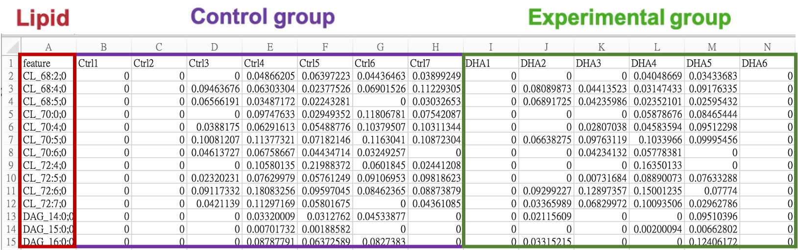
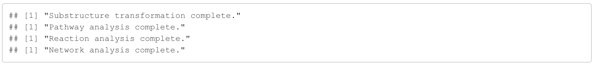
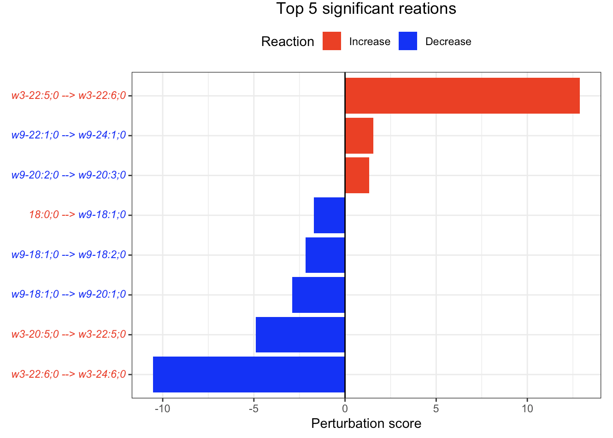
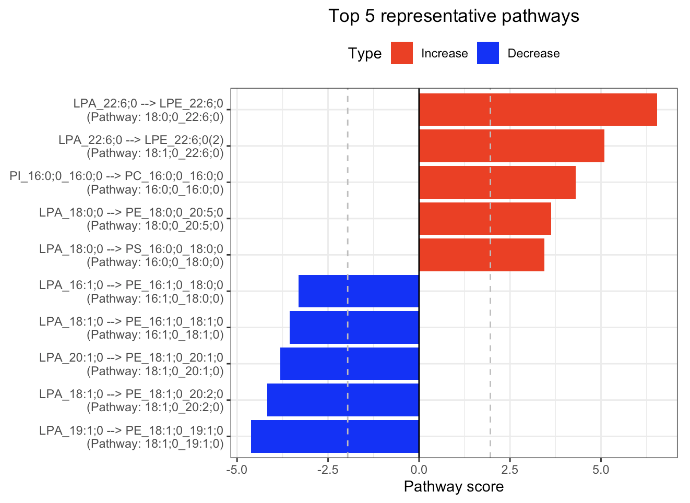
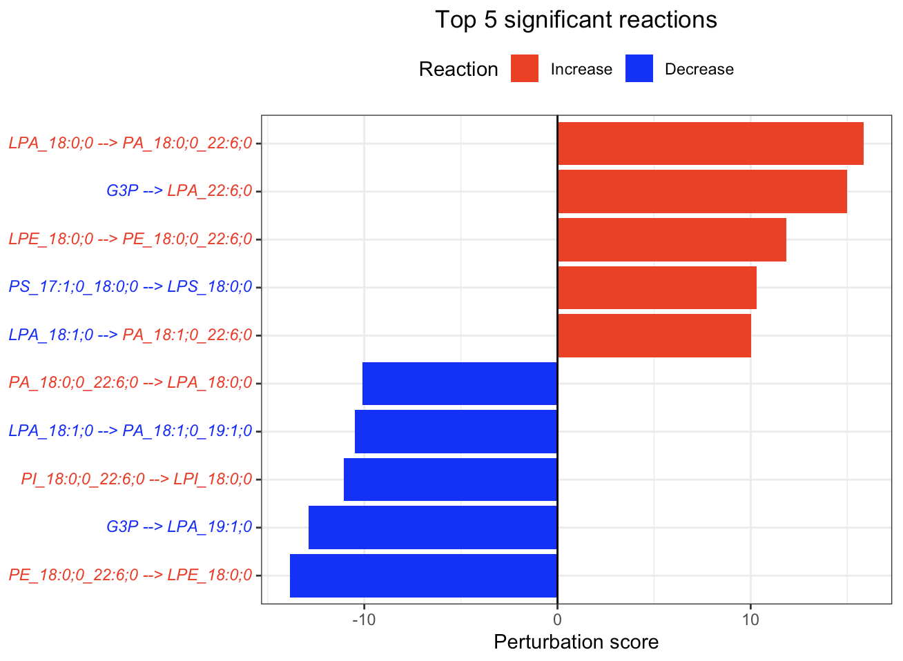

# iLipidome package

- [Overview](#overview)
- [How to install](#how-to-install)
- [System Requirements](#system-requirements)
- [Quick Example](#quick-example)
- [License](#license)

# Overview
This tutorial presents a series of ``iLipidome`` functions that facilitate a comprehensive comparison of lipid profiles using a novel substructure-based approach. iLipidome is an innovative method that leverages the lipid biosynthetic network to analyze lipidomics data, taking into account the interdependence and interconnectedness of measured lipids. It provides 'Lipid Substructure Analysis' functionality, allowing users to decompose lipids into substructures, convert lipid expression into substructure expression, reconstruct the lipid biosynthetic network, and identify significant altered lipid pathways and their genetic origins. iLipidome currently supports "two-group comparison" and performs substructure analysis based on fatty acids, lipid species, or lipid classes, enabling comprehensive comparisons of lipid profiles across different levels. Our goal is to empower researchers with a deeper understanding of the intricate changes in lipidomics observed across various samples.


# How to install

1. Make sure you have the `devtools` R package. If you do not already have it installed, install it using `install.packages("devtools")`.
2. Run `devtools::install_github("LewisLabUCSD/iLipidome-package")` in R to install the iLipidome package, and you're done!

# System Requirements
## Hardware requirements
To run example datasets with iLipidome, you only need a standard computer with sufficient RAM and R software version 4.0.0 or higher installed.

## Software requirements
### OS Requirements
The functions and example datasets have been tested on the following systems:
+ macOS: Ventura (13.3, 13.4)
+ Windows 10 Pro (version 21H2)

### R Dependencies
The version information about R, the OS and attached or loaded packages for `iLipidome` are listed below.


# Quick Example
## Library iLipidome package 
```{r Source function and load required data}
library("iLipidome")

```

## Upload lipidomics data
iLipidome only requires users to upload a processed lipid expression table (data.frame) for analysis. The table should have lipids as rows and samples as columns. Lipid names should be placed in the first column, labeled as “feature”, and sample names should be in the first row. It is important to have a minimum of two samples in each group for accurate statistical calculations. Depending on the data source, preprocessing and normalization techniques like missing value imputation or log transformation may be necessary to improve analysis outcomes.

Lipid names in the table can be represented in two formats:
1. When the exact identity of FAs is unknown, the lipids can be represented using the following format:
[LipidClassAbbreviation]_[sum of FA chain length] : [sum of FA double bonds] ; [sum of FA oxygens]

For example, PC_34:1;0 or TAG_52:1;0

2. When the exact identity of FAs is known, the lipids can be represented using the following format:
[LipidClassAbbreviation]_[FA1 chain length] : [FA1 double bonds] ; [FA1 oxygens]_[FA2 chain length] : [FA2 double bonds] ; [FA2 oxygens]…

For example, PC_16:0;0_18:1;0 or TAG_16:0;0_18:0;0_18:1;0



You can refer to the ‘supported_lipid_class.csv’ file for the supported lipid classes, their abbreviations, and the corresponding number of FAs. Note that when using the exact identity format of FAs, we will verify if the fatty acid numbers match those recorded in the ‘supported_lipid_class.csv’ file. If they do not match, the analysis will be interrupted. Also, lipid classes with the same number of FAs (e.g., PC, PE) in the same pathways (e.g., Glycerophospholipid) should have a consistent lipid naming format. For example, PC_36:0;0 and PE_34:0;0 or PC_18:0;0_18:0;0 and PE_16:0;0_18:0;0. Additionally, dihydrosphingolipids (dh-) specify sphingolipids with sphingoid bases of 18:0:2 instead of 18:1:2.

[Download supported lipid class](readme_fig_table/supported_lipid_class.csv)

[Download example dataset 1 (FA)](readme_fig_table/example_dataset_FA.csv)

[Download example dataset 1 (Lipid class)](readme_fig_table/example_dataset_LipidClass.csv)

[Download example dataset 1 (Lipid species)](readme_fig_table/example_dataset_LipidSpecies.csv)

[Download example dataset 2](readme_fig_table/example_dataset2.csv)

[Download example dataset 3](readme_fig_table/example_dataset3.csv)


```{r Upload lipidomics data and process format}

#Expression table of example lipidomics dataset

head(example_dataset_FA)
head(example_dataset_LipidClass)
head(example_dataset_LipidSpecies)

```

## 1. FA substructure analysis


### 1-1. Run analysis
 <font size="3"> The FA_substructure_analysis function allows users to conduct fatty acid substructure analysis and generates visualizations in the form of tables, bar plots, and networks. These visualizations assist in understanding and interpreting the results of the analysis. The parameters are listed below:

1. exp_raw: The input should be a data frame with lipid species as rows and samples as columns. The first column should contain lipid names, and the remaining columns should consist of numeric lipid values.

2. method: A character string specifying the statistical method to be used. The available options are two-sample t-tests ("t.test") or Wilcoxon tests ("wilcox.test").

3. ctrl: An integer vector specifying the samples in the control group within the lipid expression table. The first column, which contains lipid names, is not included in the count.

4. exp: An integer vector specifying the samples in the experimental group within the lipid expression table.

5. unmapped_FA: NULL or a character vector that allows users to specify which fatty acids (FAs) should be ignored. Users can refer to the "S1" and "P1" columns of "FA_network" to identify and select specific fatty acid names. Due to limitations in mass spectrometry, precise double bond locations for fatty acids are often not available in lipidomics data. As a result, certain fatty acids may have multiple candidate mappings in the fatty acid network. However, some fatty acid isomers may be dominant, while others may be negligible. For exmaple, the major isomer of FA 20:4 is omega-6, not omega-3. Treating all isomers equally in the substructure calculation may not accurately reflect their true abundance. This parameter enables users to select low-expressed fatty acid isomers to exclude from decomposition into substructures within the fatty acid network, therefore improving the accuracy of calculations.
[See FA network](readme_fig_table/required_data/FA_network.csv)

6. exo_lipid: NULL or character vector used to specify the exogenous lipid treatment in the analysis. If an exogenous lipid treatment is involved in the study, it can significantly influence the results of substructure calculation based on biosynthetic pathways. To address this issue, iLipidome provides a parameter for users to exclude the effects of the exogenous treatment. Users can refer to the "S1" and "P1" columns of "FA_network" to identify and select specific fatty acid names.
[See FA network](readme_fig_table/required_data/FA_network.csv)

8. species: "human", "mouse", or "rat" can be used to label species-specific genes for lipid reactions.

9. add_reaction: NULL or a data frame consisting of three columns: "from", "to", and "pathway" to add the fatty acid reactions. The fatty acids in the "from" and "to" columns should adhere to the format [FA chain length]:[FA double bonds];[FA oxygens]. The prefixes "w9-", "w7-", "w6-", and "w3-" can also be included to provide information about the double bond position. The "pathway" column in the table can take one of the following values: "Non_essential_FA_synthesis", "Omega_6_FA_synthesis", "Omega_3_FA_synthesis", or "Unknown".
[See FA network](readme_fig_table/required_data/FA_network.csv)

11. delete_reaction: NULL or a data frame consisting of two columns: "from" and "to" delete the fatty acid reactions. The fatty acids in the "from" and "to" columns should correspond to the fatty acids listed in the "S1" and "P1" columns of "FA_network".
[See FA network](readme_fig_table/required_data/FA_network.csv)

Users can fine-tune these parameters to achieve optimal results.</font>
 
```{r FA substructure analysis 1}

FA_substructure_result <- 
  FA_substructure_analysis(exp_raw = example_dataset_FA,
                           method='t.test',
                           ctrl=1:7, exp=8:13,
                           unmapped_FA = c('w9-18:2;0','w3-20:4;0'),
                           exo_lipid='w3-22:6;0', species='rat',
                           add_reaction = NULL,
                           delete_reaction = NULL)

```


 
### 1-2. Differential expression results

 <font size="3">  In this section, we present the results of the differential expression analysis conducted on the substructure-transformed data. </font>


```{r FA substructure analysis 2}

#Differential expression result table
head(FA_substructure_result[[1]])

#Volcano plot of differentially expressed substructures
FA_substructure_result[[2]]

```


### 1-3. Pathway analysis results
 <font size="3"> In the 'Pathway analysis' section, the figure showcases the top 5 significant representative pathways within the network. Increased pathways are highlighted in red, while decreased pathways are shown in blue. A pathway is considered significant if its score exceeds  1.96. The figure represents pathways using starting and ending lipids. Additionally, a comprehensive summary of all significant pathways can be found in the accompanying table. For a deeper understanding of how we calculate pathway scores, calibrate pathways, and select representative pathways, detailed information is available in the iLipidome paper. </font>
 
```{r FA substructure analysis 3}

#Pathway analysis result table
head(FA_substructure_result[[3]])
#Top 5 significant representative pathways
FA_substructure_result[[4]] 

```


### 1-4. Reaction analysis results
 <font size="3"> In the 'Reaction analysis' section, the figure showcases the top 5 significant reactions within the network, where red and blue colors indicate an increase and decrease, respectively. A reaction is deemed significant if its p-value is below 0.05. These reactions are represented by substrate and product lipids, with red and blue text denoting the fold change of lipids. A comprehensive summary of all significant reactions is provided in the accompanying table. For a more detailed understanding of how we calculate reaction scores, please refer to the information in the iLipidome paper. </font>
 

```{r FA substructure analysis 4}

#Reaction analysis result table
head(FA_substructure_result[[5]])
#Top 5 significant reactions
FA_substructure_result[[6]] 

```



### 1-5. Lipid network
 <font size="3"> In the 'Lipid network' section, we constructed the Fatty Acid Network and highlighted the top 5 significantly increased/decreased representative pathways and reactions. In the network visualization, red and blue colors indicate increase and decrease, respectively. The line width and color depth reflect the importance of pathways, while the text size represents the significance of reactions. Additionally, the nodes in the figure are filled based on the $log_2(\text{fold change})$ values, and their sizes represent  $−log_{10}({adjusted p-value})$. If a node exhibits significant changes in abundance, its border will be highlighted in purple. It's important to note that for the Lipid Species Network, we only include the significant pathways that belong to the top 5 increased and decreased representative pathways to simplify the connections and enhance the clarity of the network visualization. </font>
 
```{r FA substructure analysis 5}

#Node information for the network
head(FA_substructure_result[[7]])
#Edge information for the network
head(FA_substructure_result[[8]])
#Lipid network
FA_substructure_result[[9]]

```


### 1-6. Modify lipid network
 <font size="3"> "add_reaction" and "delete_reaction" parameters allow users to add or delete the reactions in the network </font>
 
```{r FA substructure analysis 6}

add_reaction <- data.frame(from=c("15:0;0","17:0;0","19:0;0"),
                           to=c("17:0;0","19:0;0","21:0;0"),
                           pathway='unknown')
delete_reaction <- data.frame(from='w9-20:1;0', to='w9-20:2;0')

FA_substructure_result <- 
  FA_substructure_analysis(example_dataset_FA, method='t.test',
                           ctrl=1:7, exp=8:13,
                           unmapped_FA = c('w9-18:2;0','w3-20:4;0'),
                           exo_lipid='w3-22:6;0', species='rat',
                           add_reaction = add_reaction,
                           delete_reaction = delete_reaction)


#Modified lipid network
FA_substructure_result[[9]]

```


## 2. Lipid class substructure analysis


### 2-1. Run analysis
<font size="3"> The lipid_class_substructure_analysis function allows users to conduct lipid class substructure analysis and generates visualizations in the form of tables, bar plots, and networks. These visualizations assist in understanding and interpreting the results of the analysis. The parameters are listed below:

1. exp_raw: The input should be a data frame with lipid species as rows and samples as columns. The first column should contain lipid names, and the remaining columns should consist of numeric lipid values.

2. method: A character string specifying the statistical method to be used. The available options are two-sample t-tests ("t.test") or Wilcoxon tests ("wilcox.test").

3. ctrl: An integer vector specifying the samples in the control group within the lipid expression table. The first column, which contains lipid names, is not included in the count.

4. exp: An integer vector specifying the samples in the experimental group within the lipid expression table.

5. exo_lipid: NULL or character vector used to specify the exogenous lipid treatment in the analysis. If an exogenous lipid treatment is involved in the study, it can significantly influence the results of substructure calculation based on biosynthetic pathways. To address this issue, iLipidome provides a parameter for users to exclude the effects of the exogenous treatment. Users can refer to the "Abbreviation" columns of "supported_lipid_class" to identify and select specific lipid class names.
[See supported lipid class](readme_fig_table/supported_lipid_class.csv)

7. species: "human", "mouse", or "rat" can be used to label species-specific genes for lipid reactions.

8. add_reaction: NULL or a data frame consisting of three columns: "from" and "to" add the lipid reactions. The lipids in the "from" and "to" columns should be included in the "Abbreviation" columns of "supported_lipid_class".
[See supported lipid class](readme_fig_table/supported_lipid_class.csv)

10. delete_reaction: NULL or a data frame consisting of three columns: "from" and "to" delete the lipid reactions. The lipids in the "from" and "to" columns should be included in the "Abbreviation" columns of "supported_lipid_class".
[See supported lipid class](readme_fig_table/supported_lipid_class.csv) 

Users can fine-tune these parameters to achieve optimal results.</font>

```{r lipid_class substructure analysis 1}

lipid_class_substructure_result <- 
  lipid_class_substructure_analysis(example_dataset_LipidClass, method='t.test',
                                    ctrl=1:7, exp=8:13,
                                    exo_lipid=NULL, species='rat',
                                    add_reaction = NULL,
                                    delete_reaction =NULL)

```


### 2-2. Differential expression results

<font size="3">  In this section, we present the results of the differential expression analysis conducted on the substructure-transformed data. </font>
  
  
```{r lipid_class substructure analysis 2}

#Differential expression result table
head(lipid_class_substructure_result[[1]])

#Volcano plot of differentially expressed substructures
lipid_class_substructure_result[[2]]

```


### 2-3. Pathway analysis results
<font size="3"> In the 'Pathway analysis' section, the figure showcases the top 5 significant representative pathways within the network. Increased pathways are highlighted in red, while decreased pathways are shown in blue. A pathway is considered significant if its score exceeds  1.96. The figure represents pathways using starting and ending lipids. Additionally, a comprehensive summary of all significant pathways can be found in the accompanying table. For a deeper understanding of how we calculate pathway scores, calibrate pathways, and select representative pathways, detailed information is available in the iLipidome paper. </font>
  
```{r lipid_class substructure analysis 3}

#Pathway analysis result table
head(lipid_class_substructure_result[[3]])
#Top 5 significant representative pathways
lipid_class_substructure_result[[4]] 

```


### 2-4. Reaction analysis results
<font size="3"> In the 'Reaction analysis' section, the figure showcases the top 5 significant reactions within the network, where red and blue colors indicate an increase and decrease, respectively. A reaction is deemed significant if its p-value is below 0.05. These reactions are represented by substrate and product lipids, with red and blue text denoting the fold change of lipids. A comprehensive summary of all significant reactions is provided in the accompanying table. For a more detailed understanding of how we calculate reaction scores, please refer to the information in the iLipidome paper. </font>
  
```{r lipid_class substructure analysis 4}

#Reaction analysis result table
head(lipid_class_substructure_result[[5]])
#Top 5 significant reactions
lipid_class_substructure_result[[6]] 

```


### 2-5. Lipid network
<font size="3"> In the 'Lipid network' section, we constructed the Lipid Class Network and highlighted the top 5 significantly increased/decreased representative pathways and reactions. In the network visualization, red and blue colors indicate increase and decrease, respectively. The line width and color depth reflect the importance of pathways, while the text size represents the significance of reactions. Additionally, the nodes in the figure are filled based on the $log_2(\text{fold change})$ values, and their sizes represent  $−log_{10}(\text{adjusted p-value})$. If a node exhibits significant changes in abundance, its border will be highlighted in purple. It's important to note that for the Lipid Species Network, we only include the significant pathways that belong to the top 5 increased and decreased representative pathways to simplify the connections and enhance the clarity of the network visualization. </font>
 
```{r lipid_class substructure analysis 5}

#Node information for the network
head(lipid_class_substructure_result[[7]])
#Edge information for the network
head(lipid_class_substructure_result[[8]])
#Lipid network
lipid_class_substructure_result[[9]]

```


### 1-6. Modify lipid network
 <font size="3"> "add_reaction" and "delete_reaction" parameters allow users to add or delete the reactions in the network </font>
 
```{r lipid_class substructure analysis 6}

add_reaction <- data.frame(from='CL', to='PG')
delete_reaction = data.frame(from='PE', to='PC')

lipid_class_substructure_result <- 
  lipid_class_substructure_analysis(example_dataset_LipidClass, method='t.test',
                                    ctrl=1:7, exp=8:13,
                                    exo_lipid=NULL, species='rat',                          
                                    add_reaction = add_reaction,
                                    delete_reaction = delete_reaction)
                                    

#Modified lipid network
lipid_class_substructure_result[[9]]

```


## 3. Lipid species substructure analysis


### 3-1. Run analysis
<font size="3"> The lipid_species_substructure_analysis function allows users to conduct lipid species substructure analysis and generates visualizations in the form of tables, bar plots, and networks. These visualizations assist in understanding and interpreting the results of the analysis. The parameters are listed below:

1. exp_raw: The input should be a data frame with lipid species as rows and samples as columns. The first column should contain lipid names, and the remaining columns should consist of numeric lipid values.

2. method: A character string specifying the statistical method to be used. The available options are two-sample t-tests ("t.test") or Wilcoxon tests ("wilcox.test").

3. ctrl: An integer vector specifying the samples in the control group within the lipid expression table. The first column, which contains lipid names, is not included in the count.

4. exp: An integer vector specifying the samples in the experimental group within the lipid expression table.

5. non_missing_pct: A value between 0 and 1 to set the threshold for the percentage of non-missing values in a biosynthetic pathway. Increasing this value will result in fewer biosynthetic pathways being retained. This parameter enables users to regulate the substructure decomposition process, reducing artifacts that may arise from excessive decomposition. Usually, values between 0.3 and 0.7 are commonly used for this parameter.

6. exo_lipid: NULL or character vector used to specify the exogenous lipid treatment in the analysis. If an exogenous lipid treatment is involved in the study, it can significantly influence the results of substructure calculation based on biosynthetic pathways. To address this issue, iLipidome provides a parameter for users to exclude the effects of the exogenous treatment. Please ensure that the lipid names you enter correspond to those present in the 'feature' column of the uploaded dataset.

8. species: "human", "mouse", or "rat" can be used to label species-specific genes for lipid reactions.

9. add_reaction: NULL or a data frame consisting of three columns: "from" and "to" add the lipid reactions. The lipids in the "from" and "to" columns should be included in the "Abbreviation" columns of "supported_lipid_class". The example is the same as the one used in the lipid class analysis.
[See supported lipid class](readme_fig_table/supported_lipid_class.csv)

10. delete_reaction: NULL or a data frame consisting of three columns: "from" and "to" delete the lipid reactions. The lipids in the "from" and "to" columns should be included in the "Abbreviation" columns of "supported_lipid_class". The example is the same as the one used in the lipid class analysis.
[See supported lipid class](readme_fig_table/supported_lipid_class.csv)

Users can fine-tune these parameters to achieve optimal results.</font>

```{r lipid_species substructure analysis 1}

lipid_species_substructure_result <- 
  lipid_species_substructure_analysis(example_dataset_LipidSpecies,
                                      method='t.test',
                                      ctrl=1:7, exp=8:13,
                                      non_missing_pct = 0.3,
                                      exo_lipid=NULL, species='rat',
                                      add_reaction = NULL,
                                      delete_reaction =NULL)

```


### 3-2. Differential expression results

<font size="3">  In this section, we present the results of the differential expression analysis conducted on the substructure-transformed data. </font>
  
  
```{r lipid_species substructure analysis 2}

#Differential expression result table
head(lipid_species_substructure_result[[1]])

#Volcano plot of differentially expressed substructures
lipid_species_substructure_result[[2]]

```


### 3-3. Pathway analysis results
<font size="3"> In the 'Pathway analysis' section, the figure showcases the top 5 significant representative pathways within the network. Increased pathways are highlighted in red, while decreased pathways are shown in blue. A pathway is considered significant if its score exceeds  1.96. The figure represents pathways using starting and ending lipids. Additionally, a comprehensive summary of all significant pathways can be found in the accompanying table. For a deeper understanding of how we calculate pathway scores, calibrate pathways, and select representative pathways, detailed information is available in the iLipidome paper. </font>
  
```{r lipid_species substructure analysis 3}

#Pathway analysis result table
head(lipid_species_substructure_result[[3]])
#Top 5 significant representative pathways
lipid_species_substructure_result[[4]]

```





### 3-4. Reaction analysis results
<font size="3"> In the 'Reaction analysis' section, the figure showcases the top 5 significant reactions within the network, where red and blue colors indicate an increase and decrease, respectively. A reaction is deemed significant if its p-value is below 0.05. These reactions are represented by substrate and product lipids, with red and blue text denoting the fold change of lipids. A comprehensive summary of all significant reactions is provided in the accompanying table. For a more detailed understanding of how we calculate reaction scores, please refer to the information in the iLipidome paper. </font>
  
  
```{r lipid_species substructure analysis 4}

#Reaction analysis result table
head(lipid_species_substructure_result[[5]])
#Top 5 significant reactions
lipid_species_substructure_result[[6]] 

```




### 3-5. Lipid network
<font size="3"> In the 'Lipid network' section, we constructed the Lipid Species Network and highlighted the top 5 significantly increased/decreased representative pathways and reactions. In the network visualization, red and blue colors indicate increase and decrease, respectively. The line width and color depth reflect the importance of pathways, while the text size represents the significance of reactions. Additionally, the nodes in the figure are filled based on the $log_2(\text{fold change})$ values, and their sizes represent  $−log_{10}(\text{adjusted p-value})$. If a node exhibits significant changes in abundance, its border will be highlighted in purple. It's important to note that for the Lipid Species Network, we only include the significant pathways that belong to the top 5 increased and decreased representative pathways to simplify the connections and enhance the clarity of the network visualization. </font>
 
```{r lipid_species substructure analysis 5}

#Node information for the network
head(lipid_species_substructure_result[[7]])
#Edge information for the network
head(lipid_species_substructure_result[[8]])
#Lipid network
lipid_species_substructure_result[[9]]

```


# License

MIT License

Copyright (c) 2023 Wen-Jen Lin, Austin W.T. Chiang, Evanston H. Zhou and others

Permission is hereby granted, free of charge, to any person obtaining
a copy of this software and associated documentation files (the
"Software"), to deal in the Software without restriction, including
without limitation the rights to use, copy, modify, merge, publish,
distribute, sublicense, and/or sell copies of the Software, and to
permit persons to whom the Software is furnished to do so, subject to
the following conditions:

The above copyright notice and this permission notice shall be
included in all copies or substantial portions of the Software.

THE SOFTWARE IS PROVIDED "AS IS", WITHOUT WARRANTY OF ANY KIND,
EXPRESS OR IMPLIED, INCLUDING BUT NOT LIMITED TO THE WARRANTIES OF
MERCHANTABILITY, FITNESS FOR A PARTICULAR PURPOSE AND
NONINFRINGEMENT. IN NO EVENT SHALL THE AUTHORS OR COPYRIGHT HOLDERS BE
LIABLE FOR ANY CLAIM, DAMAGES OR OTHER LIABILITY, WHETHER IN AN ACTION
OF CONTRACT, TORT OR OTHERWISE, ARISING FROM, OUT OF OR IN CONNECTION
WITH THE SOFTWARE OR THE USE OR OTHER DEALINGS IN THE SOFTWARE.
